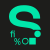

<!-- ### Hi there, I'm Erko Bridee -->

[][website]
[](https://twitter.com/intent/follow?original_referer=https%3A%2F%2Fgithub.com%2Ferkobridee&screen_name=erkobridee)
[][linkedin]
[][instagram]
[][polywork]

<!-- [][codersrank] <a href="https://sourcerer.io/erkobridee"></a> -->
<!-- <br /> -->

<!--[][youtube]-->

my business card on the CLI:

```shell
npx erkobridee
```

<br />

## Who am I?

Hey there! I'm Erko Bridee de Almeida Cabrera, a Brazilian tech enthusiast with a big love for gaming, anime, and electronic tunes. I dove into computer science because I couldn't resist uncovering the secrets behind my favorite games! Lucky me, I'm married to an amazing wife who's not just a fantastic mom but also my biggest supporter. Together, we're raising two incredible daughters, and our family adventures are the highlight of my life. I'm all about soaking up knowledge and enjoying every moment with my loved ones. Let's keep exploring and learning together!

<!--
## I'm a Husband, Father, Developer and a Curious Person

- 🔭&nbsp;&nbsp;I’m currently working as **Senior Software Engineer**

- 🌱&nbsp;&nbsp;I’m currently learning **Microservices Architecture**
-->


<br />

### Would you like to see some more code outside of my GitHub profile?

[][codesandbox]
[][codepen]
[![Repl.it](https://img.shields.io/badge/-repl.it-555555?style=for-the-badge&logoColor=white&logo=data:image/svg+xml;base64,PHN2ZyByb2xlPSJpbWciIHZpZXdCb3g9IjAgMCAyNCAyNCIgeG1sbnM9Imh0dHA6Ly93d3cudzMub3JnLzIwMDAvc3ZnIj48cGF0aCBmaWxsPSIjRkZGIiBkPSJNMTIuMjY1LjAwMmExMS45MTEgMTEuOTExIDAgMDAtMi40MzcuMjA0YzEzLjg3NiAxLjcwNCAxMC4yNyAxNy45NCAxLjcxNyAxNy44MTkgMCAwIDEyLjQ1MyAxLjYyNSAxMS42NzMtMTAuMjE1QTExLjkxMSAxMS45MTEgMCAwMDEyLjI2NS4wMDJ6TTguMjEzLjgyN2MtLjIuMDAyLS40MDIuMDA4LS42MS4wMTZBMTEuODU2IDExLjg1NiAwIDAwLjE0NiAxMy42MDhDMi45My0uNDIxIDE4LjgwNSA0LjEyMiAxNy45IDEyLjY4OGMwIDAgMi44NS0xMi4wMTQtOS42ODgtMTEuODYxem0xLjQ1NCA1LjAzNUM2LjAwMiA1Ljg4Ni42OTEgNy40NS44MTYgMTYuMzQ0YTEyLjAxMyAxMi4wMTMgMCAwMDIuODk3IDQuMzNjLjA1Mi4wNTEuMTA4LjEuMTYyLjE0OWExMi4wMiAxMi4wMiAwIDAwMS4xMzcuOTI2Yy4wNjEuMDQ0LjEyLjA5Mi4xODEuMTM1YTExLjkzIDExLjkzIDAgMDAxLjMxMi43NzljLjEzMi4wNjguMjY2LjEzLjQuMTkzYTExLjg1NCAxMS44NTQgMCAwMDEuMTk5LjQ4NmMuMS4wMzQuMTk1LjA3Ny4yOTcuMTA5YTExLjg3NCAxMS44NzQgMCAwMDEuNDkuMzUzYy4xNTMuMDI3LjMwNy4wNS40NjEuMDdhMTIuMDE2IDEyLjAxNiAwIDAwMS41NzguMTIzbC4wNi4wMDNjLjQgMCAuNzkyLS4wMjEgMS4xOC0uMDYtMTMuOTQ5LTMuMzI3LTguNjQ1LTE4LjkyNC0uMTE0LTE3LjY4IDAgMC0xLjQ2OS0uNDEtMy4zODktLjM5OHptMi40MzYgMi43NjJhMy4zNTUgMy4zNTUgMCAxMDMuMzU0IDMuMzU2IDMuMzU1IDMuMzU1IDAgMDAtMy4zNTQtMy4zNTZ6bS01Ljk1IDIuMTkyUzIuODIgMjMuMDkgMTYuMTcyIDIzLjE5NmExMS45NzggMTEuOTc4IDAgMDA3Ljc0My05Ljk5MmMuMDMzLS4zMTkuMDQzLS42NDQuMDUtLjk3LjAwMS0uMDg1LjAxMy0uMTY4LjAxMy0uMjU1IDAtLjM3MS0uMDIzLS43MzctLjA1Ni0xLjEtMy41MjcgMTMuODg3LTE5LjEzMiA4LjQ0OC0xNy43Ny0uMDYzeiIvPjwvc3ZnPgo=)][replit]
[][stackblitz]

<br />

### Languages and Tools:

#### Backend

<p align="left">


<!--  -->
<!--  -->


<!--  -->
<!--  -->

<!--  -->

<!--  -->
<!--  -->
<!--  -->
<!--  -->

<!--  -->
<!--  -->
<!--  -->

<!--  -->
<!--  -->
<!--  -->


</p>

#### Frontend

<p align="left">


</p>

#### Database

<p align="left">


</p>

#### Cloud Provider

<p align="left">


</p>

#### DevOps

<p align="left">


<!--  -->


<!--  -->
</p>

#### Another Tools

<p align="left">


<!--  -->


</p>

<br />

<details>
<summary>🤩&nbsp;&nbsp;GitHub stats</summary>
<table>
  <tr>
  <td>

[](https://github.com/erkobridee)

  </td>
  <td>
  
[](https://github.com/erkobridee)
  
  </td>
  </tr>
  <tr>
  <td colspan="2" style="text-align: center;">

[](https://github.com/erkobridee)

</td>
  </tr>
</table>
</details>

<br />


<!-- https://yhype.me/ -->


<!-- ----------------------------------------------------------------------- -->

[website]: https://erkobridee.com
[twitter]: https://twitter.com/erkobridee
[youtube]: https://youtube.com/erkobridee
[instagram]: https://instagram.com/erkobridee
[polywork]: https://www.polywork.com/erkobridee
[linkedin]: https://linkedin.com/in/erkobridee
[stackblitz]: https://stackblitz.com/@erkobridee
[codepen]: https://codepen.io/erkobridee
[codesandbox]: https://codesandbox.io/u/erkobridee/
[replit]: https://repl.it/@erkobridee
[codersrank]: https://profile.codersrank.io/user/erkobridee
